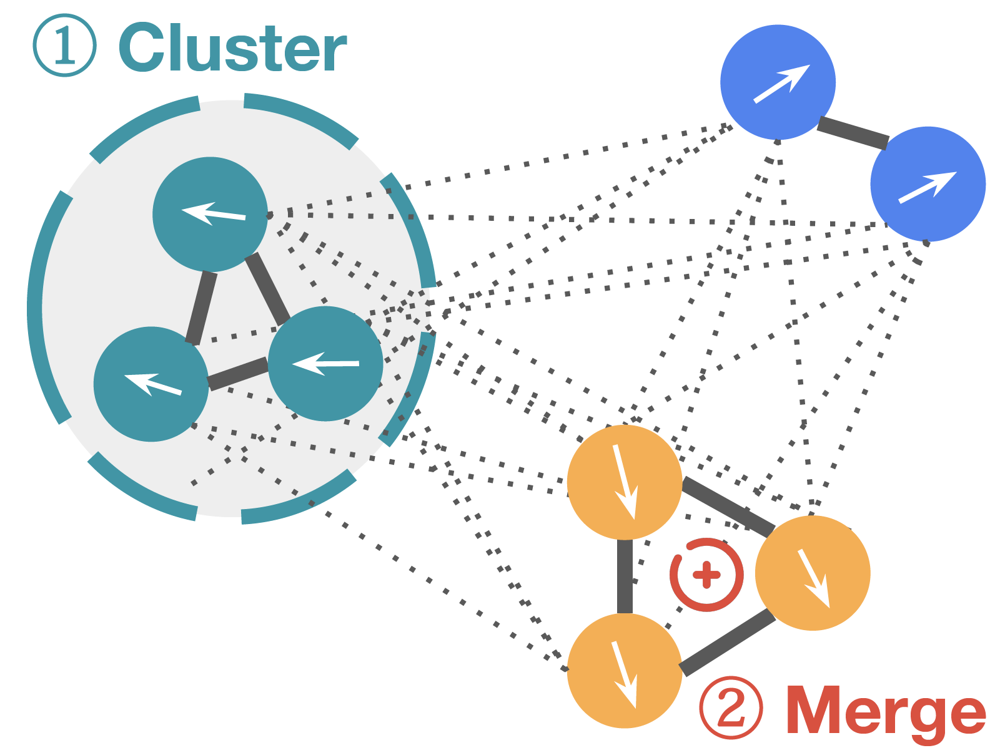

# Task Vector Basis

This is the official repository that implements the bases algorithms in [Efficient Model Editing with Task Vector Bases: A Theoretical Framework and Scalable Approach](https://arxiv.org/pdf/2502.01015).



## Introduction

Task vectors, which are derived from the difference between pre-trained and fine-tuned modelweights, enable flexible task adaptation and model merging through arithmetic operations such as addition and negation. However, existing approaches often rely on heuristics with limited theoretical support, often leading to performance gaps comparing to direct task fine tuning. Meanwhile, although it is easy to manipulate saved task vectors with arithmetic for different purposes, such compositional flexibility demands high memory usage, especially when dealing with a huge number of tasks, limiting scalability. This work addresses these issues with a theoretically grounded framework that explains task vector arithmetic and introduces the task vector bases framework. Building upon existing task arithmetic literature, our method significantly reduces the memory cost for downstream arithmetic with little effort, while achieving competitive performance and maintaining compositional advantage, providing a practical solution for large-scale task arithmetic.

## Installation

To run the code, please install all its dependencies:

```bash
git clone https://github.com/uiuctml/TaskVectorBasis.git
cd TaskVectorBasis
conda env create -n task-vector-basis --file environment.yml
```

## Datasets
To download and prepare the vision datasets, please follow the instructions in [this issue](https://github.com/mlfoundations/task_vectors/issues/1). For 12-task language datasets, please follow [LM-BFF-main](https://github.com/princeton-nlp/LM-BFF#prepare-the-data) to prepare the data.


## Vision Experiments

Please follow the instructions in `MERS_exp.ipynb` to prepare for inner merging results. Then, if the outer merging method is task-arithmetic, use `bash cmd/run_outerTA.sh`.

## Medium-scale Natural Language Experiments

Once fine-tuning is finished (see [Localize-and-Stitch](https://github.com/uiuctml/Localize-and-Stitch)), run `L&S/language/clustering.ipynb` to inspect the clustering result. Then to bases-L&S methods can be by running:
- SharedMask: `python main_localize_stitch_SharedMask.py`
- StitchTwice: `python main_localize_stitch_StitchTwice.py`

To test these two methods on new tasks, please edit the highlighted TODO lines to reflect the cluster result updates.


## Large-scale Natural Language Experiments

To finetune on one single dataset:
```bash
python src/nlp_mlm.py --dataset <YOUR TASK NAME> --main train --seed 0
```

To run basis addition, first run the clustering result:
```bash
python src/nlp_merge.py --seed 0
```
then run bad task filtering and merge finally:
```bash
python src/nlp_mlm.py --main eval_majority --seed 0
python src/nlp_mlm.py --main basis_merging --merge_method weight_averaging --seed 0
```

## Acknowledgement
Our repository is built upon [tangent_task_arithmetic](https://github.com/gortizji/tangent_task_arithmetic), [Localize-and-Stitch](https://github.com/uiuctml/Localize-and-Stitch).

## Reference
If you find this code useful, please cite the following paper:
```bibtex
@article{zeng2025efficient,
  title={Efficient Model Editing with Task Vector Bases: A Theoretical Framework and Scalable Approach},
  author={Zeng, Siqi and He, Yifei and You, Weiqiu and Hao, Yifan and Tsai, Yao-Hung Hubert and Yamada, Makoto and Zhao, Han},
  journal={arXiv preprint arXiv:2502.01015},
  year={2025}
}
```

## Contact
Feel free to open Issues or contact siqi6@illinois.edu for any questions or comments.